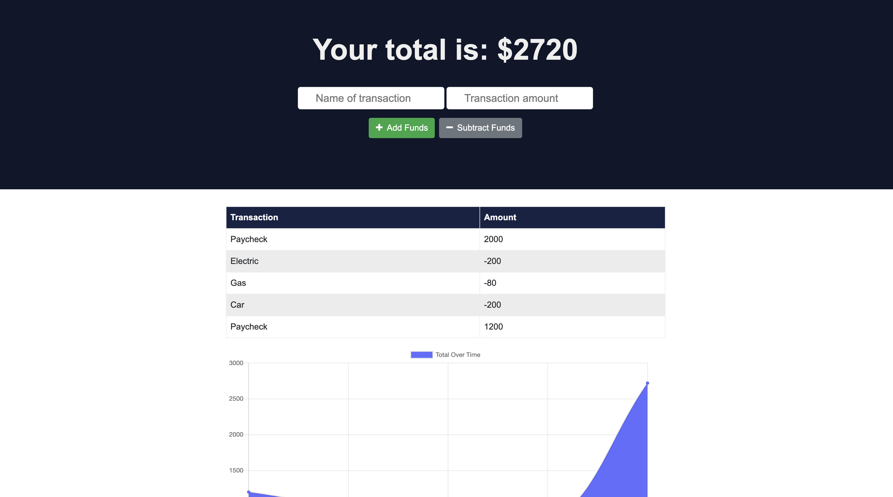

# Unit 18 PWA Homework: Online/Offline Budget Trackers

A Budget Tracker application to allow for offline access and functionality to keep track of your spending anywhere! Users are able to add expenses and deposits to their budget with or without an internet connection, their budget sheet will still populate and then sync when they are back online

GIVEN a user is on Budget App without an internet connection
WHEN the user inputs a withdrawal or deposit
THEN that will be shown on the page, and added to their transaction history when their connection is back online.

Offline Functionality:

  * Enter deposits offline

  * Enter expenses offline

When brought back online:

  * Offline entries should be added to tracker.

- - -

### Overview

Giving users a fast and easy way to track their money is important, but allowing them to access that information anytime is even more important. Having offline functionality is paramount to our applications success.

[Live Application](https://shielded-scrubland-93441.herokuapp.com/)



- - -

### Initial Installation
Copy the repo with complted code and information. Once on your local machine use the following command in your terminal:

```
npm install 
```
- with no paramerters will just be sure you pull down dependancies listed in the json file
- only run if there are existing dependancies in the json file

All dependanies are listed within the package.json file so they will install automatically. If you run into any missed dependancies or want to add some of your own custom code use the following command: 
```
npm install (package name)
```
- run for other dependancies
- Just add in each package with the name of the package

- - -

### Creating Live Applicaition
To send live, you will need to create a MongoDB Atlas account and connect a batabase from there to your application. Once you have your Atlas account you will connect this to Heroku.

- - -

### Hosting on Heroku

The app is hosted by Heroku and can be viewed here: [Live Application](https://shielded-scrubland-93441.herokuapp.com/)

- - -

#### Contributor
##### Ashley Hunt
##### * [GitHub](https://github.com/ashhunt07)
##### * [Contact](https://ashhunt07.github.io/portfolio/contact.html)
